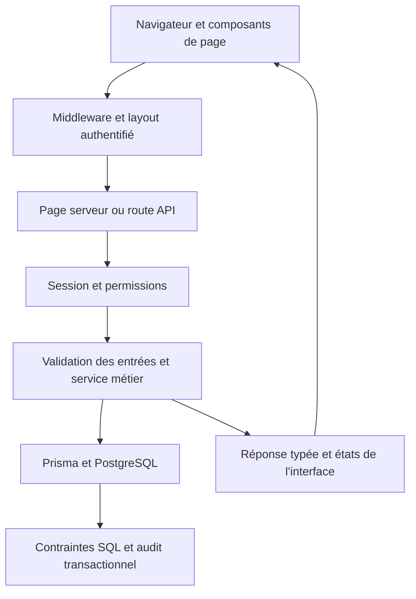

# Compréhension de Noctambule au 10 octobre 2026

> État observé avant la correction documentaire du même jour. Les liens, index et
> statuts ont depuis été repris dans le [rapport d’organisation](ORGANISATION_DOCUMENTAIRE_2026-10-10.md).
> Les résultats techniques ci-dessous restent datés ; cette correction ne les rejoue pas.

Noctambule est un outil privé de gestion d'une structure esport associative,
préparé à accueillir davantage de fonctions métier et une éventuelle société.
Le produit actuellement accessible se concentre sur les comptes, leur sécurité,
le répertoire des personnes, la conservation de l'audit et la feuille de route.
Les équipes, saisons, adhésions, contrats et finances restent des chantiers futurs.

Cette photographie relie le produit au code et conserve les résultats de la
passe de compréhension demandée le 10 octobre 2026. Les
[références canoniques](../qualite/REFERENCES.md) restent propriétaires des règles.
Aucune fonctionnalité, permission ou donnée métier n'a été modifiée pendant
cette passe.

## Périmètre de compréhension

L'inventaire de `apps/web/src`, `packages/database/src`,
`packages/database/scripts` et `packages/shared/src` contient 385 fichiers
TypeScript, TSX, MJS ou CSS, tests web inclus, soit environ 86 000 lignes.
L'application déclare 34 fichiers de routes API, 13 fichiers `page.tsx` et
19 modèles Prisma. Le dossier des migrations contient 51 fichiers SQL.

La lecture a suivi les points d'entrée, imports, contrats, principaux services
et parcours de chaque domaine, puis les tests et scripts d'exploitation.
Cet inventaire global et ces lectures ciblées ne constituent pas une inspection
exhaustive de chaque ligne ni une validation de chaque interaction privée.

Pour les écritures documentaires de cette passe : Q01, Q19, Q27 et Q30 ont été
examinés. Q02 à Q18, Q20 à Q26, Q28 et Q29 sont hors impact du changement : les
fonctions correspondantes sont étudiées, sans modification du produit, du schéma,
des accès ou de l'exploitation.

## Organisation technique

| Emplacement | Responsabilité |
| --- | --- |
| `apps/web` | Application Next.js 15.5.23, React 19, TypeScript, Tailwind 4, primitives Radix et composants UI partagés |
| `apps/web/src/app` | Pages App Router, adaptateurs HTTP, layout racine, styles globaux |
| `apps/web/src/features` | Domaines personnes, comptes personnels, utilisateurs, paramètres, recherche de pages, feuille de route ; code conservé d'actualité et de tableau de bord |
| `apps/web/src/shared` | Authentification, MFA, permissions, navigation, audit, pagination, configuration, contexte utilisateur et utilitaires |
| `apps/web/src/components` | Structure commune du site et composants réutilisables ; une part importante de l'administration des utilisateurs demeure ici |
| `packages/database` | PostgreSQL, Prisma 6.19.3, migrations, génération du client, sauvegarde, restauration et outils d'exploitation |
| `packages/shared` | Contrats utilisables dans le navigateur, notamment miroirs des enums, sans importer le client de base |
| `docs/references` | Décisions et politiques courantes |
| `docs/qualite/pages` | Suivis des pages et décisions locales |
| `features/pages`, `docs/plans`, `docs/audits` | Préparation et historique ; leur présence ne prouve pas qu'un module est livré |

Le monorepo utilise les workspaces Bun et Turborepo. Le manifeste racine annonce
Bun 1.3.10 ; les contrôles de cette passe ont utilisé Bun 1.4.2 et Node 24.14.0.
Les résultats ne prouvent donc pas une reproduction avec la version Bun annoncée.
Next sépare `.next-dev` et `.next-build` afin de permettre le développement et la
compilation de production dans le même espace de travail.

Le contrat de découpage est plus abouti dans `features/persons/server` que dans
l'administration des comptes : `shared/server/auth.ts`,
`components/users/UserDetailPage.tsx` et `app/api/users/[id]/route.ts` conservent
plusieurs responsabilités et dépassent chacun mille lignes.

## Site actuellement accessible

| Route ou parcours | Fonction réelle |
| --- | --- |
| `/login` | Identifiant et mot de passe, puis activation ou vérification MFA ; option d'appareil de confiance sauf pour le superadmin |
| `/` | Accueil volontairement léger : salutation et texte d'attente. Le composant de statistiques conservé n'est pas monté par cette page |
| `/membres/repertoire` | Recherche, statut dans/hors structure, tri, pagination par curseur, synthèse globale et accès aux fiches |
| `/membres/repertoire/nouveau` | Création d'identité et de coordonnées, sous permission de création et disponibilité du service |
| `/membres/repertoire/[id]` | Identité, coordonnées, réseaux, historique contextuel de champs et suppression selon les droits |
| `/systeme/utilisateurs` | Liste des comptes, recherche, filtres, statistiques et pagination numérotée |
| `/systeme/utilisateurs/nouveau` | Création de compte et remise d'un mot de passe temporaire ; ADMIN réservé au compte protégé |
| `/systeme/utilisateurs/[id]` | Profil, sécurité, accès administratifs et autonomie personnelle ; historique conservé dans le code mais retiré des sections actuelles |
| `/mon-compte` | Profil et sécurité du compte connecté, avec composants partagés de la fiche utilisateur |
| `/systeme/parametres` | Paramètre `audit.retentionDays`, rendu par la route générique `/systeme/[[...slug]]` |
| `/systeme/feuille-de-route` | Catalogue des projets futurs, accessible aux comptes connectés |
| `/systeme`, `/administration`, `/tableau-de-bord` et anciens chemins | Entrées et redirections de compatibilité, pas de nouveaux modules autonomes |

Les cinq entrées principales se répartissent actuellement entre Aujourd'hui,
Membres et Système. Mon compte et la recherche rapide sont des outils globaux.
La recherche rapide indexe les pages autorisées ; elle ne cherche pas dans tous
les dossiers métier.

L'actualité interne est `planned` dans le registre. Ses composants, services,
permissions et table `InternalAnnouncement` subsistent, mais sa route publique
redirige vers la feuille de route et aucune route API d'actualité ne figure dans
l'inventaire actuel. Un contrôle de schéma `internalNews: ready` ne signifie donc
pas que l'écran est livré.

Les notifications, la page de recherche complète et la vue globale du journal
sont retirées. Le journal serveur et l'API d'historique des utilisateurs restent
présents. L'API `/api/dashboard` subsiste également, bien que l'accueil ne monte
plus le composant qui présentait ces statistiques.

Sources : [registre](../../apps/web/src/shared/constants/feature-registry.constants.ts),
[routes et alias](../../apps/web/src/shared/constants/routes.constants.ts),
[accueil](../../apps/web/src/app/page.tsx).

## Données et règles métier

Le [schéma Prisma](../../packages/database/prisma/schema.prisma) contient les
ensembles suivants :

| Ensemble | Modèles |
| --- | --- |
| Comptes | `User`, `LoginNameReservation`, `Session` |
| Double authentification | `TotpCredential`, `TotpEnrollment`, `MfaRecoveryCode`, `MfaLoginChallenge` |
| Répertoire | `Person`, `PersonEmail`, `PersonPhone`, `PersonSocialProfile`, `PersonDeletionTombstone` |
| Historique | `AuditLog`, `AuditFieldChange`, `AuditEncryptionKeyVersion` |
| Infrastructure et données conservées | `RateLimit`, `SystemSetting`, `InternalAnnouncement`, `ArchivedStaffProfile` |

**Personne et compte sont deux objets indépendants.** Le modèle actuel ne les
relie pas automatiquement, même avec un email identique. La fiche Personne
porte l'identité et les coordonnées ; le compte porte la connexion et les droits.
Une fiche exige un pseudo ou un prénom et un nom. Le nom du compte utilisateur
est désormais facultatif, conformément à la migration du 10 octobre.

Les coordonnées sont normalisées et bornées : dix emails, dix téléphones et
vingt profils sociaux par personne. Les doublons entre personnes donnent des
avertissements ; ils ne déclenchent aucune fusion automatique. Les coordonnées
principales et leur unicité disposent de contrôles applicatifs et de contraintes
SQL, dont certaines ne sont pas entièrement décrites dans `schema.prisma`.

Les mutations des personnes utilisent des versions optimistes et associent
modification et audit dans une transaction. Les changements des coordonnées
font aussi évoluer la version de la personne. L'historique des valeurs sensibles
est chiffré ; cela ne signifie pas que toutes les colonnes courantes de Personne
sont chiffrées. La consultation de cet historique demande à la fois l'accès au
répertoire et la permission d'historique de champs.

La suppression d'une personne purge ses coordonnées et valeurs d'historique
dans une transaction, puis conserve une trace technique immuable et un événement
d'audit. La suppression d'un utilisateur suit un autre parcours : compte
préalablement désactivé, anonymisation, révocation des secrets et sessions,
conservation d'une ligne technique et des réservations d'identifiants.

La cible métier distingue personnes, comptes, relations datées, équipes,
entités juridiques, saisons sportives et exercices financiers. Ces objets futurs
ne doivent pas être déduits des anciennes migrations ni fusionnés avec les rôles
techniques `USER` et `ADMIN`. Voir [STRUCTURE](../references/STRUCTURE.md).

## Circulation des données et protections

Le middleware fournit notamment CSRF, CSP avec nonce, identifiants de requête,
en-têtes de confidentialité des API et limitation générale des requêtes. Le
layout privé vérifie la session côté serveur. Les routes API vérifient ensuite
l'authentification et les permissions : le menu masqué ne constitue pas la
protection.

Les sessions stockent un dérivé du jeton. La connexion exige le second facteur,
avec secret TOTP chiffré, prévention de réutilisation et codes de récupération
à usage unique. Les changements sensibles utilisent des preuves récentes de
mot de passe et, selon l'action, de MFA. `securityVersion` permet d'invalider
les sessions après des changements de sécurité.

Les droits combinent le rôle, des surcharges individuelles configurables et
leurs dépendances. Le compte racine protégé possède des règles spécifiques ;
il n'est pas un troisième rôle Prisma. Accorder, retirer et déléguer des droits
sont des capacités différentes. Les champs de contact et de sécurité des
utilisateurs sont filtrés selon le lecteur.

Les protections ci-dessus ont été examinées dans le code et dans les tests
existants. Elles ne valent pas certification de sécurité ni essai exhaustif
des combinaisons de droits avec une base réelle.

## Interface et conventions à conserver

Les listes Répertoire et Utilisateurs sont les références visuelles actuelles.
Le système partagé repose sur `PageIdentityHero`, `PageShell`, `PageAsideLayout`,
`DataTableSection`, `directory.module.css` et les primitives de `components/ui`.
Les couleurs proviennent de `globals.css` ; les pages de gestion privilégient
des surfaces sombres, des lignes alternées et une densité maîtrisée.

La sidebar reste ouverte sur ordinateur et devient un volet mobile. Les fiches
utilisent une navigation de sections et une vue d'ensemble. Les filtres et retours
de listes sont liés à l'URL ; les formulaires disposent de gardes de navigation
pour les modifications non enregistrées. Les chargements, refus, conflits et
erreurs ont des composants dédiés. L'autocomplétion désactivée est une décision
explicite du projet, avec les exceptions documentées pour l'authentification.

Sources : [design system](../references/DESIGN_SYSTEM.md),
[suivi du répertoire](../qualite/pages/membres-repertoire.md),
[suivi des utilisateurs](../qualite/pages/systeme-utilisateurs.md).

## Exploitation

Le mode d'exploitation actuel prévoit un processus web et aucun worker permanent.
Une commande ponctuelle de maintenance purge les éléments expirés et applique la
conservation du journal. La limitation générale en mémoire suppose ce mode
d'exploitation ; les opérations sensibles utilisent déjà un limiteur en base.

La sauvegarde v9 associe JSONL, checksum et signature Ed25519. La restauration
vérifie le format, la signature, les clés d'audit nécessaires et une cible vide.
Restaurer une sauvegarde antérieure à une suppression peut réintroduire les
données supprimées : le contrôle de l'opérateur reste nécessaire, comme prévu
dans [OPERATIONS](../references/OPERATIONS.md).

Les migrations contiennent des contraintes, index et triggers importants :
protection du compte racine, immutabilité des traces de suppression, audit et
unicité des coordonnées principales. Un schéma Prisma correct ne suffit pas
à prouver que tous ces objets SQL existent dans une installation.

## Résultats des contrôles

| Contrôle exécuté | Résultat et portée |
| --- | --- |
| `bun run lint` | Réussi sur les trois packages ; résultat partagé repris du cache Turbo |
| `bun run typecheck` | Réussi ; web exécuté, database et shared repris du cache Turbo |
| `bun run test` dans `apps/web` | 967 tests réussis, 3 échoués ; 78 fichiers réussis sur 80 |
| `bun run test` dans `packages/database` | 21 tests réussis ; formats, signature, stockage déclaré et garde-fous de performance, sans restauration réelle |
| `bun run build` dans `apps/web` | Compilation de production réussie, avec lint et types |
| `bun run --filter web check:performance` | Budget de bundles respecté ; route la plus lourde à 314 929 octets gzip, sous la limite de 332 800 octets |
| `bun run --filter web check:architecture` | Échec : `components/ui/sidebar.tsx`, 925 lignes pour 900 ; `features/persons/components/PersonsList.tsx`, 894 pour 800, selon le compteur du script |
| `bun run docs:check` | Réussi sur les 46 fichiers couverts avant ajout de cette synthèse ; ce script ne parcourt pas toutes les références et tous les audits |
| Navigateur Chromium sur le serveur local existant | `/login` répond 200, aucune erreur JavaScript observée ; captures inspectées à 1440 × 1000 et 390 × 844 ; pas de débordement horizontal à 390 px |
| Accès anonyme | Répertoire et Utilisateurs redirigent vers `/login?next=…` ; leurs API GET renvoient 401 |
| Santé du serveur local | `live` et `ready` répondent 200 ; base, schéma, répertoire et schéma d'actualité annoncés disponibles |

La réussite du budget gzip mesure le poids des ressources, pas les temps de
réponse de la base ni la fluidité sur un téléphone réel. Le site privé n'a pas
été parcouru avec une session authentifiée. Les variables de base et de compte
E2E dédiés sont absentes de l'environnement ; la suite E2E n'a pas été lancée.
Les migrations, purges, sauvegardes et restaurations n'ont pas été exécutées.

## Points à traiter

### Total incorrect après changement de page dans le répertoire

**Défaut établi par lecture du code, parcours réel non rejoué.** Dans
[listPersons](../../apps/web/src/features/persons/server/person-core.service.ts),
`COUNT(*) OVER()` est calculé dans la requête qui applique déjà `cursorClause`.
Le résultat compte les lignes restantes après le curseur. Il est pourtant transmis
comme `pagination.total`, puis utilisé pour le nombre de membres trouvés et le
nombre total de pages dans
[PersonsList](../../apps/web/src/features/persons/components/PersonsList.tsx).

Sur un jeu inchangé de 60 personnes, avec 25 résultats par page, cette logique
donnerait successivement 60, 35 et 10 comme totaux, donc 3, 2 et 1 pages annoncées.
Il faut dissocier le total filtré du filtre de progression, ou revoir la promesse
de total de l'interface. La fenêtre de comptage et les trois agrégations globales
méritent aussi une mesure à volume ; aucun ralentissement n'est démontré ici.
Une tentative de vérification SQL synthétique sans données métier n'a pas pu
joindre la base directement depuis le processus d'analyse.

### Trois tests web échouent

- `person-pages-permissions.test.ts` : deux scénarios de création de personne
  ne dépassent pas le squelette de chargement. La page utilise `useSearchParams`
  sous `Suspense`, tandis que le test ne fournit pas le contexte de navigation.
  Le montage de test est à vérifier avant d'en déduire un défaut de permission.
- `shadcn-boundaries.test.ts` : les cartes radio de création d'utilisateur
  utilisent directement `<label>` et `<input>` aux lignes 97 et 105. Le contrôle
  impose les primitives partagées pour ces éléments. Le choix des cartes radio
  est déjà une décision documentée ; le problème porte sur leur réalisation
  et son accord avec le contrat UI.

La commande complète `check` ne peut pas être déclarée réussie dans cet état :
les tests et le contrôle d'architecture échouent indépendamment du build réussi.

### Code conservé et documentation à relire lors des prochains changements

L'actualité, l'ancien tableau de bord et les vues d'historique conservées doivent
être distingués des écrans actifs avant toute réutilisation. Leur suppression
automatique n'est pas décidée par cette analyse.

Certaines descriptions de navigation mentionnent encore une page de recherche
complète, des notifications ou quatre pôles actuels, malgré les retraits plus
récents. Plusieurs liens de `docs/references` gardent aussi des chemins relatifs
antérieurs au rangement documentaire ; `docs:check` ne couvre pas ce dossier.

Le test E2E existant attend un lien « Mon compte » dans le contenu principal de
l'accueil ; le code actuel de cette page ne le rend plus. Cet écart statique est
à réconcilier avant une prochaine exécution E2E, sans le présenter comme un
résultat de test déjà obtenu.

## Repères pour les prochains travaux

Un changement de personne commence dans `features/persons`, puis suit ses routes
API et contraintes de données. Un changement de compte touche fréquemment
`components/users`, `features/users`, `shared/server/auth.ts` et les routes users.
Un changement transversal d'accès doit relire le catalogue de permissions,
ses dépendances, les projections de données et les contrôles serveur.

Une nouvelle page doit partir de sa règle métier et des décisions actuelles,
puis réutiliser les composants des listes de référence. La feuille de route
décrit des capacités futures ; elle n'autorise pas à les considérer comme
implémentées ou à modifier les engagements historiques.

## Organisation documentaire et fiabilité du suivi

Complément du 10 octobre 2026 à la question sur l'organisation de tous les
documents. L'arborescence est cohérente : références courantes, méthode de
qualité, suivis de pages, plans et audits possèdent des responsabilités distinctes.
Les modèles prévoient décisions, contrôles réellement exécutés, points ouverts
et déclencheurs de réexamen. La séparation entre périmètre futur et livré est
explicitement prévue. Il faut conserver cette structure et fiabiliser son contenu.

Le contrôle des liens Markdown locaux de 161 documents sous `docs/` et
`features/`, hors blocs de code clôturés et liens externes, relève 200 occurrences
dont la cible n'existe pas à l'emplacement indiqué, réparties dans 13 fichiers :

| Emplacement | Occurrences de liens vers une cible introuvable |
| --- | --- |
| `docs/references` | 17 |
| `docs/plans` | 33 |
| `docs/audits` | 150 |
| `docs/qualite` et `features` | 0 dans les liens Markdown examinés |

Ce comptage vérifie les chemins, pas les ancres internes, les URL externes ou
les chemins écrits uniquement entre backticks. Dans les audits historiques,
certains fichiers ont été retirés intentionnellement : il faut signaler leur
statut ou fournir une référence historique, sans les recréer pour réparer un lien.
Dans les références courantes, plusieurs chemins n'ont pas suivi le déplacement
vers `docs/references` ; par exemple le lien de FEATURE_ARCHITECTURE vers
`qualite/REVUE_GENERALE.md` devrait remonter au dossier `docs`.

Autres écarts précis :

- `features/pages/README.md` et le titre de la matrice annoncent encore
  37 chantiers, alors que la feuille de route et le catalogue applicatif en
  comptent 39. Le README mentionne aussi quatre pôles actifs contre trois dans
  le registre actuel.
- L'index des suivis et les « Décisions courantes » de la navigation décrivent
  encore les notifications du header, retirées le 9 octobre. Les résultats de
  septembre restent un historique utile, mais ne doivent plus décrire l'état
  courant.
- Le suivi Paramètres annonce le retrait des notifications en début de fichier,
  mais sa section « Rejouer la régression de concurrence » donne encore une
  commande vers `notification-retention.integration.test.ts`, fichier absent.
- L'index Utilisateurs reste intitulé « liste », alors que le suivi couvre aussi
  la création et la fiche. Les mentions « terminée » des listes doivent préciser
  leur portée visuelle et rester lisibles avec les défauts et validations ouverts.
- Les intentions restent réparties entre `features/*.md`, `features/pages/*`
  et `docs/plans/*`. Les fiches de pages sont généralement marquées historiques,
  mais le statut et la source courante sont moins explicites dans certaines
  anciennes fiches à la racine de `features` et dans `docs/plans/FEATURES.md`.

Le script `docs:check` ne couvre que ses 46 fichiers sélectionnés. Il ne parcourt
pas `docs/references`, `docs/plans`, `docs/audits` ni `features` et ne vérifie pas
l'existence des fichiers cités dans les commandes. Sa réussite ne prouve donc
pas que l'ensemble documentaire est navigable et exécutable.

Pour un suivi fiable, les priorités sont de réparer les liens des sources
courantes, réconcilier les index et statuts, distinguer clairement la synthèse
actuelle de l'historique, puis élargir le contrôle documentaire avec un traitement
explicite des archives. Les points ouverts doivent rester dans le document
propriétaire, avec action et déclencheur, sans multiplier les tableaux concurrents.
Cette passe consigne le diagnostic ; elle n'applique pas une réorganisation.
